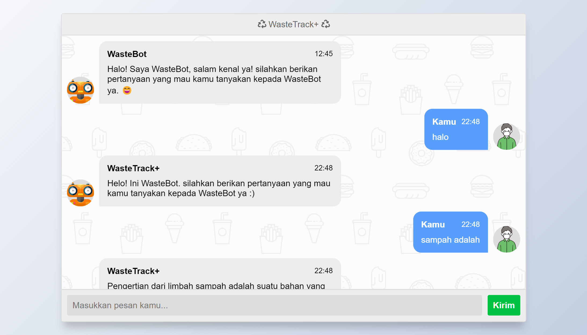

# WasteTrack Chatbot Flask

This project is a simple chatbot implemented using Flask, Python, and a pre-trained model. The chatbot interacts with users, processes their input, and generates appropriate responses based on the trained model.

## 📷 Screenshot


## ✨ Prerequisites

- Python 3.x
- Flask
- TensorFlow (or Keras)
- scikit-learn
- NLTK

## 🤖 Installation

1. Clone the repository:
   ```shell
   git clone https://github.com/bimarakajati/WasteTrack-Chatbot-API.git
   ```

2. Install the required dependencies:
    ```shell
    pip install -r requirements.txt
    ```

## 💁‍ Usage

1. Run the Flask app:
   ```shell
   python main.py
   ```
2. Open your web browser and navigate to http://localhost:5000 to access the chat interface.
3. Start chatting with the chatbot by entering your messages in the input field and pressing Enter.
4. The chatbot will respond with generated replies based on the pre-trained model's predictions.

## ✨ Author

|             Name            |      NIM       |       Job Desk       |
| --------------------------- | -------------- |----------------------|
| Afrizal Mukti Pramutiansyah | A11.2019.11893 | Chatbot              |
| Bima Rakajati               | A11.2020.13088 | Flask                |

## 📙 Reference

Thanks to their great works：
- https://buffml.com/web-based-chatbot-using-flask-api/